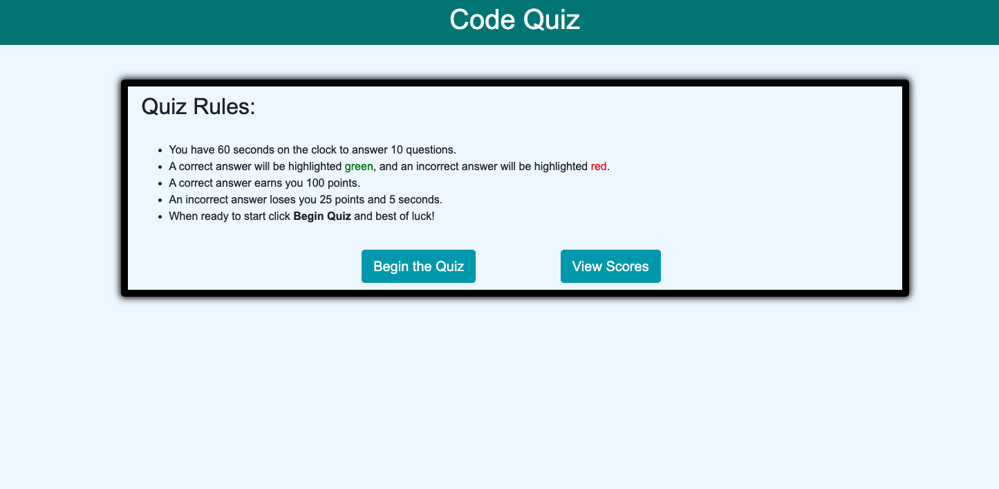
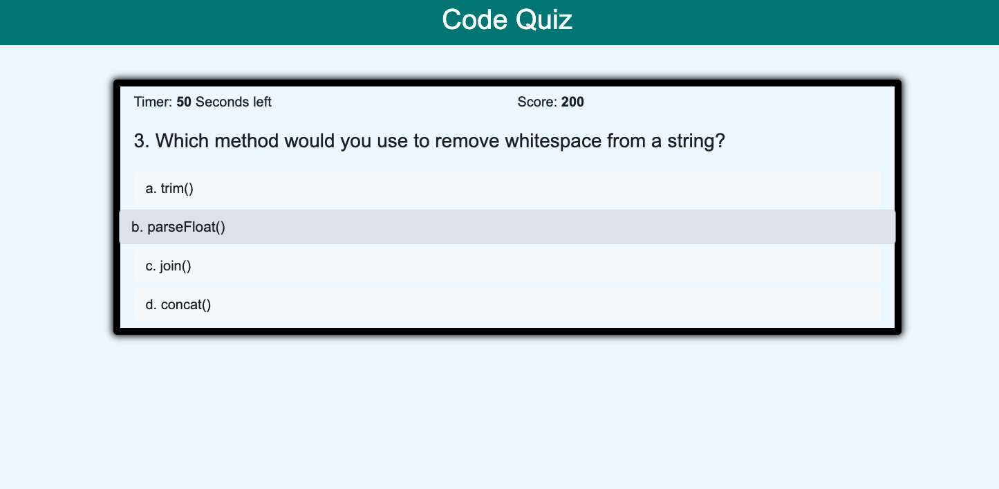
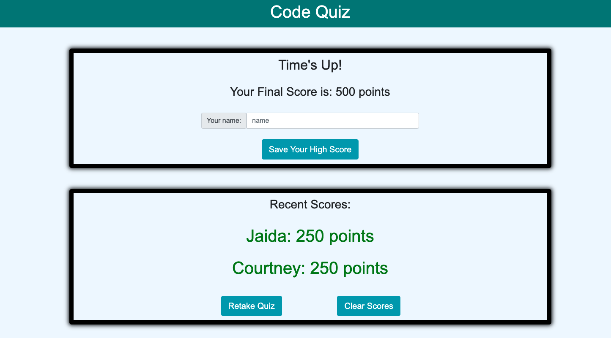
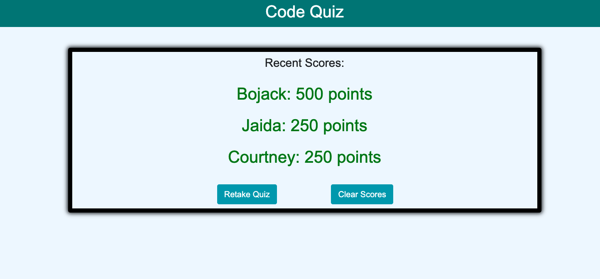

# Code_Quiz

## Description

The motivation for building this project was the desire to create an application that used JavaScript to dynamically update HTML and CSS. Implementing the Web Storage API 
and DOM API were also big motivators for building this project.

The reason for building this specific project was to have a timed quiz on JavaScript fundamentals that stored quiz scores in order to gauge knowledge and progress.

Creating this project did pose some challenges with saving information into localStorage and later retrieving it for use on the application. localStorage only stores strings, so finding the right way to store and later use that information was a challenge that was overcome in this process. Creating this project allowed me to further increase my knowledge with localStorage, the setInterval/clearInterval, and setTimeout/clearTimeout methods. It was very rewarding getting every aspect of the application to work in unison in order to provide a clean, polished, and responsive interface.

There are several features that would be ideal to implement in the future. Some of those features would be the ability to set your own time limit for the quiz, the ability to randomize the order of the questions and the order of the answers displayed. Providing different difficulty levels would also be great!

## Webpage Images

### Quiz landing page

### Quiz in progress

### Results page

### Saved scores

## Installation

No prior installation is required to use the Code_Quiz application.

## Usage

1. Head to the deployed link provided further down.
1. To begin the quiz click on the 'Begin the Quiz' button or to view recently saved scores click on the
'View Scores' button.
1. Upon clicking on 'Begin the Quiz' the timer will begin counting down from 60 seconds, and you will be
presented with the first multiple-choice question.
1. Click on the best answer.
    1. If you selected the correct answer, then your choice will be highlighted green and your score will
    increase by 100 points.
    1. If you selected the wrong answer, then your choice will be highlighted red and your score will decrement
    25 points, and you will receive a 5 second penalty.
1. After you answer the current question you will be presented with the next question for a total of 10 questions.
1. When time is up or you have answered all questions, you can provide your name or initials in order to save your score!
1. Click on the 'Retake Quiz' button to give the quiz another try or the 'Clear Scores' button to clear any saved scores.
1. Best of luck! 

## Deployed Link

https://martinmondaca.github.io/Code_Quiz/

## Technologies Used

https://getbootstrap.com/

## License

Licensed under [MIT](https://choosealicense.com/licenses/mit/) license.